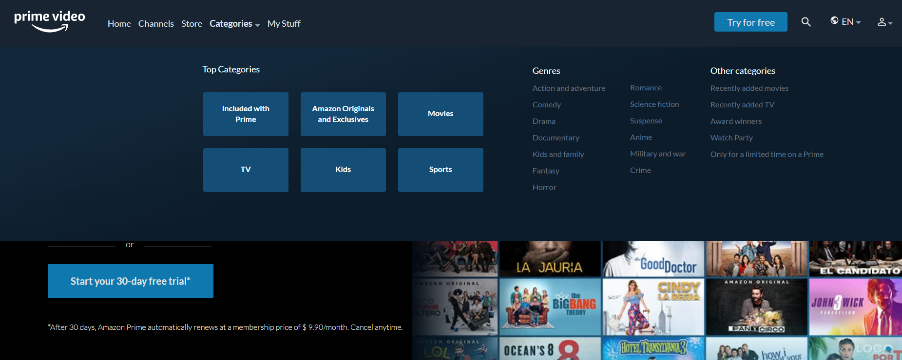
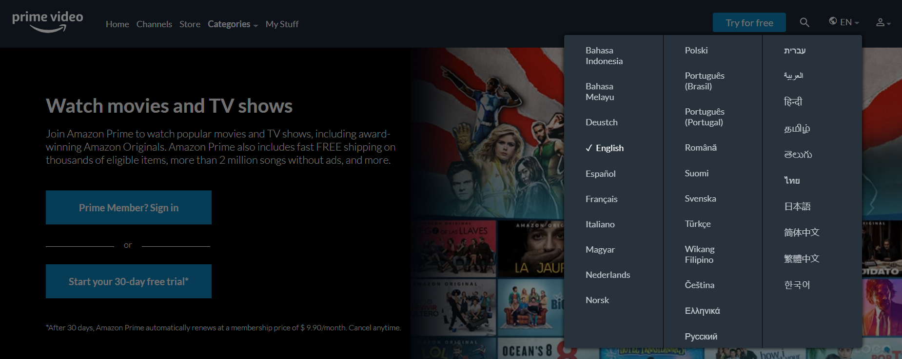
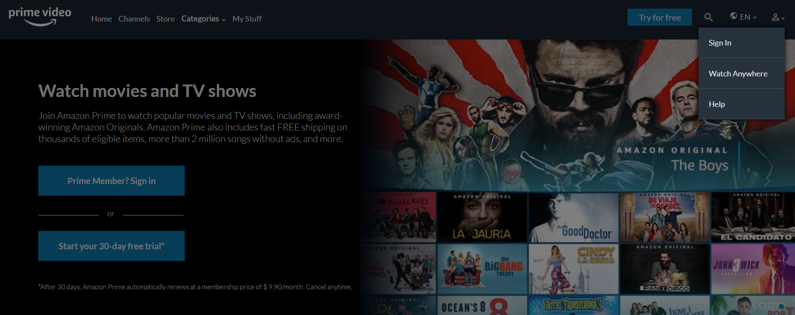
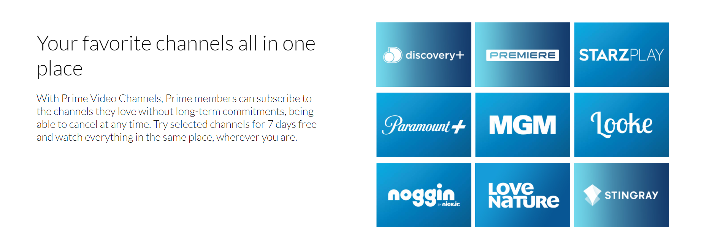
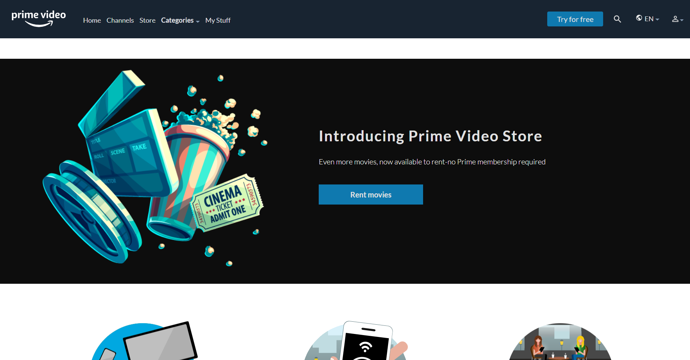
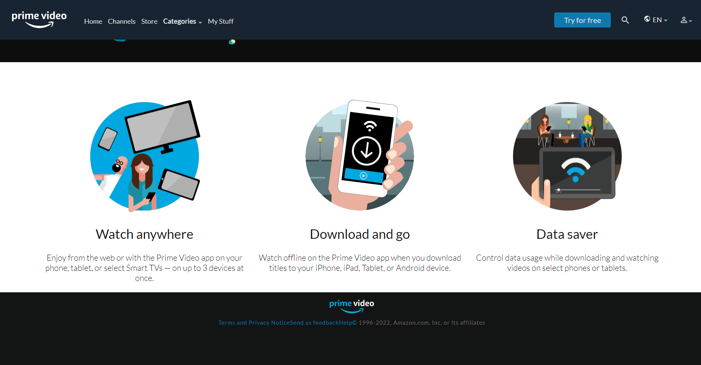
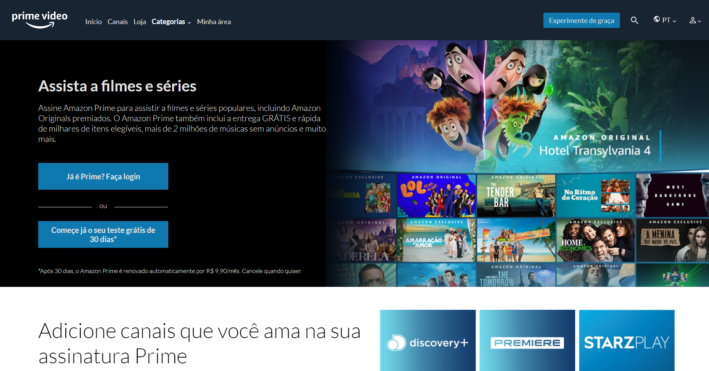

 <h1 align="center">Amazon Prime Video (Clone)🎦</h1>

<h4 align="center">
 In this project I tried to challenge myself to clone the Amazon Prime Video home page. As I used the request through the fetch method, a live server will be necessary to use the navigation between one page and another one (English page and Portuguese Page).  
 <a href="https://gustavojuvino.github.io/AmazonPrimeVideoClone/"> Amazon Prime Video Clone</a>
</h4>

<h6 align="center">
 This project was created with:
  
  
 

  
  
  
  
 

</h6>

</img>
 
 
 
 
</img>
 
 
 
 
</img>
 
 
 
 
</img>
 
 
 
 
</img>
 
 
 
 
</img>
 
 
 
 
</img>
 
 
 
 
</img>
 
 
 
 
</img>

